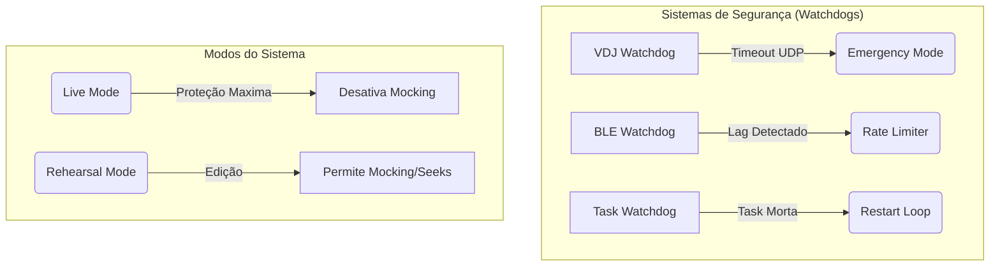

# 🚨 AUDITORIA DE RISCO PARA SHOWS AO VIVO (LIVE PERFORMANCE)
**Sistema:** FARIA Light FX + JBLController
**Perfil de Avaliação:** Missão Crítica / Engenharia de Broadcast
**Objetivo:** Sobrevivência a 6 horas de show ininterrupto.

---

## 1. VULNERABILIDADES CRÍTICAS ENCONTRADAS

### ❌ FALHA 1: "Runaway Mock" (Luzes Dançando no Silêncio)
**PROBLEMA:** Se o VirtualDJ travar ou o cabo de rede/loopback falhar, o envio UDP para. O `playback.py` detecta a queda (`is_vdj_live = False`), mas se o estado anterior era `playing = True`, o Python entra no modo Mock e **continua rodando o timecode eternamente** baseado no relógio do PC.
**EFEITO:** O áudio do show para (pane no VDJ), o DJ gela, mas as luzes continuam brilhando e disparando strobo freneticamente como se a música estivesse tocando.
**RISCO:** **CRÍTICO** (Mata a percepção de controle do show).
**COMO DETECTAR:** Timeout no pacote UDP (watchdog > 1.5s).
**COMO CORRIGIR:** Criar um "Modo Live". No Modo Live, se o UDP cair, o sistema assume `playing = False` e entra em `EMERGENCY_BLACKOUT` (ou liga uma luz azul fraca de segurança). O Mock Playback só deve existir no "Modo Ensaio".
**CÓDIGO NECESSÁRIO:** `VirtualDJWatchdog`, `LiveModeManager`.

### ❌ FALHA 2: Congestionamento da Fila BLE (Gargalo do Windows)
**PROBLEMA:** Se o DJ fizer um scratch longo ou um fade muito rápido, o `controller.py` vai disparar 60 comandos BLE por segundo. O framework `Bleak` no Windows enfileira isso. A caixa física da JBL só consegue processar ~10 a 15 comandos/seg.
**EFEITO:** A fila do Windows incha. As luzes ficam com "lag" de 3 a 5 segundos tentando processar os comandos velhos do scratch, arruinando a sincronia do drop da música.
**RISCO:** **ALTO**
**COMO DETECTAR:** Medir o tempo entre o comando gerado no Python e o `await client.write_gatt_char` terminar. Se > 50ms, há fila.
**COMO CORRIGIR:** Padrão *State-over-Event* (Debounce/Rate Limit). Se 10 cores são pedidas em 100ms, descarte as 9 primeiras e mande apenas a última.
**CÓDIGO NECESSÁRIO:** `CommandQueue(maxsize=1, behavior='overwrite_old')`, `RateLimiter`.

### ❌ FALHA 3: Espiral da Morte do Auto-Heal (CPU Spike)
**PROBLEMA:** A bateria da Beam acaba (ou alguém tropeça na tomada do Stick). A caixa desconecta. O loop de auto-heal tenta reconectar loucamente a cada 1 segundo. Cada tentativa mal sucedida do Bluetooth no Windows gera overhead no Kernel e no event loop do `asyncio`.
**EFEITO:** Após 30 minutos da caixa desligada, o notebook esquenta (thermal throttling), o Python trava e as caixas que **ainda estavam funcionando** começam a piscar torto ou parar.
**RISCO:** **ALTO**
**COMO DETECTAR:** Contador de tentativas falhas consecutivas.
**COMO CORRIGIR:** *Exponential Backoff*. Falhou 1x? Tenta em 1s. Falhou 2x? 5s. Falhou 3x? 30s. Falhou 5x? Tenta a cada 2 minutos.
**CÓDIGO NECESSÁRIO:** `ReconnectManager`, `BatteryMonitor`.

### ❌ FALHA 4: Corrupção por Morte Súbita do Banco (Locked DB)
**PROBLEMA:** O DJ marca um Cue exatamente no milissegundo que uma track nova está sendo inserida no banco, e alguém fecha o terminal ou o PC dá tela azul no meio da transação do SQLite.
**EFEITO:** O arquivo `faria_fx.db` corrompe. No próximo show, o Python não abre e dá erro de `Database is locked` ou malformed.
**RISCO:** **MÉDIO**
**COMO DETECTAR:** Impossível prever, detecta-se na inicialização.
**COMO CORRIGIR:** Usar `PRAGMA synchronous = NORMAL; PRAGMA journal_mode = WAL;`. Fazer backup automático diário de `faria_fx.db` para `faria_fx.db.bak` sempre que o sistema iniciar perfeitamente.
**CÓDIGO NECESSÁRIO:** `HealthCheck`, `DatabaseBackupHandler`.

---

## 2. ARQUITETURAS DE PROTEÇÃO SUGERIDAS

### Novas Classes / Módulos Necessários:
1. **`ShowState`**: Um Enum definindo `LIVE`, `REHEARSAL`, `PANIC`.
2. **`PerformanceMonitor`**: Classe em background medindo o tempo de execução do `_scheduler_loop`. Se passar de 40ms, joga um Warning amarelo na tela do DJ (indicando notebook muito quente).
3. **`BLEQueue`**: Um semáforo substituindo as chamadas diretas de BLE para impedir que o buffer estoure.

---

## 3. CHECKLIST DO TÉCNICO DE EVENTOS

### 📋 PRÉ-SHOW (Passagem de Som / Montagem)
- [ ] **Windows Power Settings:** Desativar "Suspensão Seletiva de USB" (Crucial para o Bluetooth não dormir).
- [ ] **Windows Updates:** Pausar atualizações por 7 dias.
- [ ] **Wi-Fi:** Desativar completamente (se não for usar rede local). O chip de Wi-Fi e Bluetooth geralmente dividem a mesma antena no notebook, desligar o Wi-Fi melhora o BLE em 100%.
- [ ] **Baterias:** Beam carregada ou ligada na tomada via fonte de potência adequada (mínimo 2A).
- [ ] **Banco de Dados:** Rodar rotina de Backup do banco de Cues.
- [ ] **Teste de Stress:** Girar o crossfader e pitch para frente e para trás loucamente por 15 segundos. Luzes devem responder e não travar.

### 📋 DURANTE O SHOW (Monitoramento)
- [ ] O notebook deve estar elevado (suporte) para circulação de ar. Thermal throttling mata loops assíncronos.
- [ ] Tela do site do JBLController deve ficar minimizada em segundo plano, ou visível apenas a barra de status. Não forçar o Chrome a renderizar Canvas a 60fps junto com o VirtualDJ se o PC não aguentar.

### 🚨 PROCEDIMENTOS DE EMERGÊNCIA (Panic Room)
**Se as luzes travarem no meio da música:**
1. Aperte a macro de **BLACKOUT** ou **COR SÓLIDA**.
2. Isso sobrescreve a fila presa.

**Se as luzes desconectarem:**
1. NÃO reinicie o VirtualDJ.
2. Reinicie apenas o console do Python. O VDJ continuará mandando UDP cegamente, o Python sobe em 3 segundos, recebe o UDP e religa as caixas em até 10 segundos sem o público notar parada na música.
